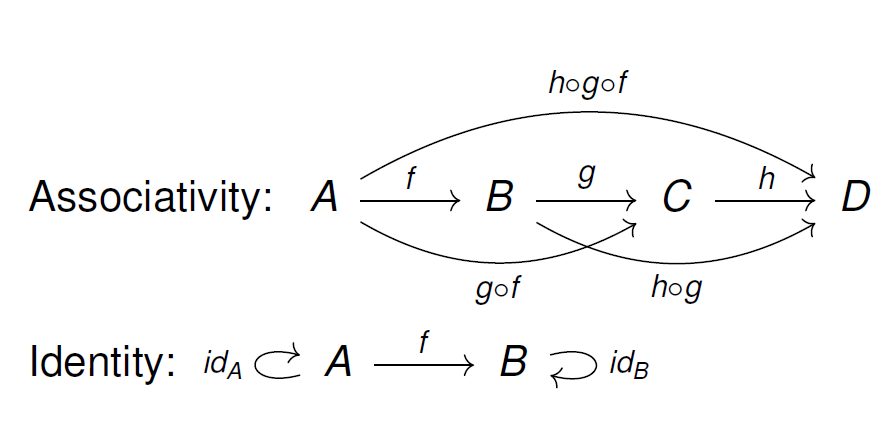
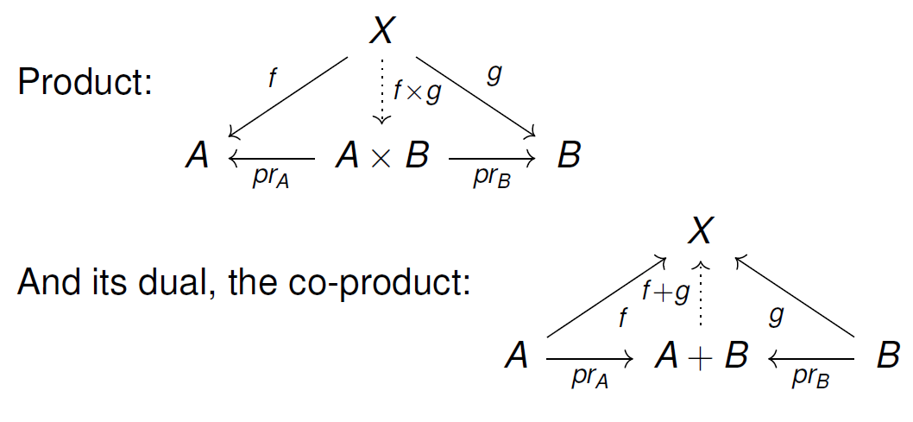
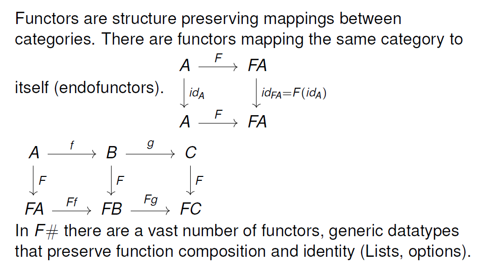
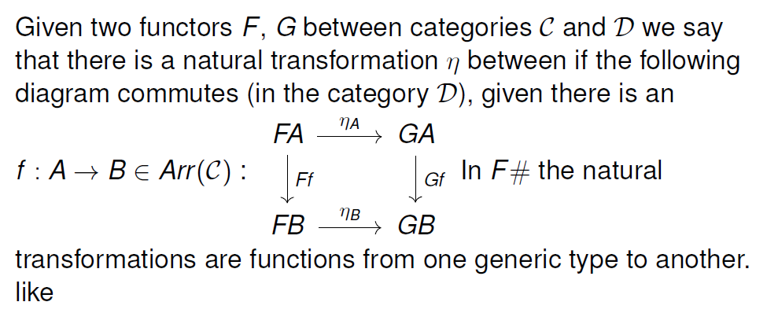
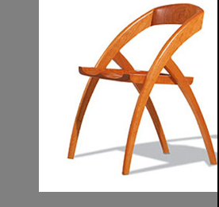
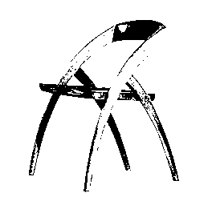
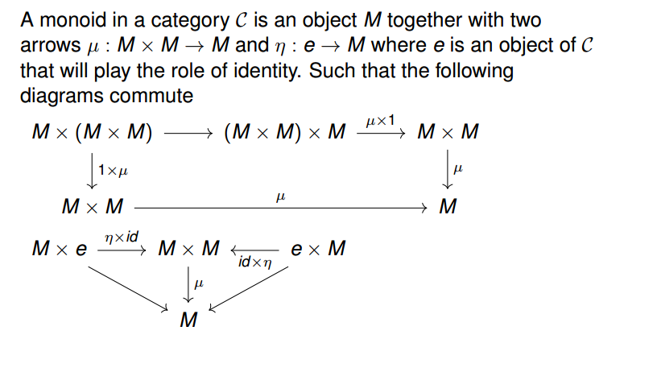
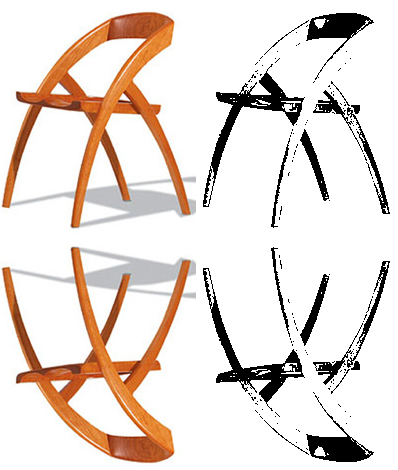

# Modules

* [The Category Pattern](#module1)
* [The Functor Pattern](#module2)
* [The Monoid Pattern](#module3)


# The Category Pattern


In this session we introduced functional programming and its foundation in mathematics.
We showed that functional programming is based on $$\lambda$$-calculus and also presented
*Category Theory* as a tools for reasoning about programs. In particular we were able to
show that functions and data types form a Category, using F# to exemplify.

Finally we introduced two ways of constructing types, *Products* and *Co-products*, and their
categorical description.

Here are the notes based on the slides. The last section contains a few exercises.


## Introduction

#### Why study functional programming?

* Fun
* Write expressive, modular, composable and elegant code.
* Reason about code and its composition (But, aren't these the buzzwords used to sell object orientation?).
* Forget low level *concurrency* primitives.
* Understand map-reduce.


#### OO vs. FP

If OO and FP both are claiming that they solve the same problems important to all software engineers, why neither of them does?

* There is no uniform accepted definition of object-orientation
* The two might be orthogonal (Scala) and even cross-definable (Martin Odersky and Dotty)
* In contrast FP is ill defined, but there is a uniform theory.

#### Ancient history

The theory of functional programming is a byproduct of the quest for the foundations of mathematics.

* 1910 - Russell and the theory of types.
* 1920 - Brouwer and the ideal of constructive mathematics.
* 1930 - Church and $$\lambda$$-calculus.
* 1947 - MacClane and Category theory.

#### Languages

* 1957, McCarthy LISP - using $$\lambda$$-calculus for actual programming.
* 1975, Milner, ML - adding types and type inference.
* Haskell - adding category theory (on user, library level).
* We will use F# as a vehicle for showing the principles of functional programming.


## Functions

#### Properties of functions

We speak of functions in a mathematical sense, it is an unequivocal mapping.

* A function take argument(s) from its $$domain$$ and returns a value from its $$target (codomain)$$

* It always returns the same value for the same argument.

* There can be functions for any domain, so in particular functions can be chained, and the chained application of functions are still unequivocal ($$composition ( \circ )$$).

#### $$\lambda$$-calculus

- Variables:  $$x,y...\in Var \subset Term$$
- Abstraction: $$ x \in Var$$ and $$M \in Term$$ then $$\lambda x.M \in Term$$
- Application: $$ M \in Term$$ and $$N \in Term$$ then $$M N \in Term$$

Associated with the following set of rules:

* $$\alpha$$-reduction, renaming: $$ MxN \rightarrow^{\alpha} MyN $$
* $$\beta$$-reduction: $$\lambda x.y z \rightarrow^{\beta} y$$ $$\langle x/z \rangle$$
* $$\eta$$-reduction: $$\lambda x.Mx \rightarrow^{\eta} M $$


### Functions in F\#


```fsharp
// Constant
let answer = 42

// One argument function
let addTwo = fun x -> x + 2

// Equivalent
let addTwo' x = x + 2

// Function of two arguments
let concat fun s1 -> fun s2 -> s1 + " " + s2

// Equivalent
let concat' s1 s2 = s1 + " " + s2
```


In case no type annotations are given the F# compiler infers the type.
Definitions can also have explicity type annotations:

```fsharp

let answer : int = 42

let addTwo (x: int) = x + 2

let concat (s1: string) s2 : string = s1 + " " +  s2

```

#### Recursion


```fsharp
// Example
factorial 4 = 4 * 3 * 2 * 1
```

```fsharp
// Recursion
let rec factorial n =
    if n <= 0 then
        1
    else
        n * (factorial (n - 1))
```

Mutual recursion is defined by `let rec .. and`:
```fsharp
let rec isEven n =
    if n < 0 then
        isEven -n
    elif n = 0 then
        true
    else
        isOdd (n - 1)
and isOdd n =
    if n = 0 then
        false
    else
        isEven (n - 1)
```

#### Function composition

```fsharp
let isEven (n: int) : bool = n % 2 = 0

let length (s: string) : int = s.Length

let hasEvenLength = length >> isEven
```

```fsharp
let compose (f: 'B -> 'C) (g: 'A -> 'B) : 'A -> 'C = fun x -> f (g x)

let (<<) = compose

let (>>) g f = compose f g
```

```fsharp
let isEven (n: int) : bool = n % 2 = 0

let length (s: string) : int = s.Length

let trim (s: string) : string = s.Trim()

let hasEvenNumChars = trim >> length >> isEven
```


#### Associativity
```fsharp
let hasEvenNumChars1 = trim >> (length >> isEven)
let hasEvenNumChars2 = (trim >> length) >> isEven
```

Is (>>) associative?
```fsharp
(f >> g) >> h                               =
// Definition of (>>)
(fun x -> g (f x)) >> h                     =
// Definition of (>>)
(fun y -> h ((fun x -> g (f x) y)           =
// Beta reduction
(fun y -> h (g (f y)))                      =

f >> (g >> h)                               =
// Definition of (>>)
fun x -> (g >> h) (f x)                     =
// Definition of (>>)
fun x -> (fun y -> h (g y)) (f x)           =
// Beta reduction
fun x -> h (g (f x))                        =
// Alpha conversion
fun y -> h (g (f y))                        =
```


## Categories
A category $$\mathcal{C}$$ is defined as:

1.  A set of objects, denoted $$Ob(\mathcal{C})$$

2. A set of arrows, $$Arr(\mathcal{C})$$ with functions  $$Dom,Codom  \in Arr(\mathcal{C}) \rightarrow Ob(\mathcal{C})$$


* Operation $$\circ \in Arr(C) \times Arr(C) \rightarrow Arr(C)$$, s.t. $$\forall f,g \in Arr(C)$$ with $$Codom(f) = Dom(g)$$, $$\exists g \circ f$$ and $$Dom(g \circ f) = Dom(f)$$ and $$Codom(g \circ f) = Codom(g)$$

* Associativivity: $$(g \circ f) \circ h = g \circ (f \circ h)$$

* $$\forall A \in Ob(\mathcal{C})  \exists id_A \in Arr(\mathcal{C})$$ s.t. $$Dom(id_A) = Codom(id_A) = A$$

* Identity: if $$f : A \longrightarrow_{f} B$$ then $$id_B \circ f = f \circ id_A = f$$



#### The Category of data and functions
```fsharp
// Composition operator
let (<<) f g = fun x -> f (g (x))

// Identity
let id (x: 'T) : 'T = x
```

```fsharp
// Associativity
(f >> g) >> h = f >> (g >> h)

// Left identity
f >> id = f

// Right identity
id >> g = g
```


## Types

* There is a problem. You can't really take simple untyped $$\lambda$$-calculi
 as a good guide for calculations.

* Consider the following term: $$ \lambda x.(x x)  \lambda x.(x x)$$.

* To defeat this Church and Curry introduced types to $$\lambda$$-calculi and
 made it a firm foundation for computation.


- Types are essential to maintain consistency in a formal
    system. In $$\lambda$$-calculi type-able terms are
    terminating calculations (normalisation).

- Types are in direct correspondence with logic, different type
    systems with different logical calculi.

- Types are not labels on memory cells, they are not merely
    assuring absence of segmentation faults, but are essential tools
    within the compilers to check correctness.

### Types in F\#
Built in:
```fsharp
int, bool, char, unit, float, string
```

#### Products:
```fsharp
// Tuples
let myTuple : (int * string * bool) = (42, "The answer", true)
```

```fsharp
// Records
type Person =
    {
        Name : string
        Email : string
        Age : int
    }

// Record construction.
let gabor = {Name = "Gabor"; Email = "gabor@foobar.com"; Age = 45}

// Access properties.
let gaborEmail = gabor.Email

// Record modification.
let olderGabor = {gabor with Age = 46}
```


#### Sum types (Co-products)
```fsharp
type Dice = | One | Two | Three | Four | Five | Six

let randomDice = Five
```


```fsharp

/// Union type with arguments.
type Contact =
    | Email of string
    | Phone of string
    | Address of Address

let contact = Email "gabor@foobar.com"
```

```fsharp

// Parameterized
type Option<'T> =
    | Some of 'T
    | None

let someInt : Option<int> = Some 42

let nothing : Option<string> = None
```

Product types in category theory



## Pattern matching
```fsharp
type Address = {Street : string; Number : int; Zip : string}

type Contact =
    | Email of string
    | Phone of string
    | Address of Address

let printContact (contact: Contact) =
    match contact with
    | Email e    -> printfn "Email: %e" s
    | Phone f    -> printfn "Phone: %s" f
    | Address ad -> printfn "Adress: %s %A %s" ad.Street ad.Number ad.Zip

```

## Recursive data structures
Example - representing boolean expressions
```fsharp
type Exp =
    | True
    | False
    | Not of Exp
    | And of Exp * Exp
    | Or of Exp * Exp

let example = And (Not (Or (False,True)), True)
```
```fsharp

let rec eval exp =
    match exp with
    | True          -> true
    | False         -> false
    | Not e         -> not (eval e)
    | And (e1,e2)   -> (eval e1) && (eval e2)
    | Or (e1,e2)    -> (eval e1) || (eval e2)
```


Example - Representing natural numbers using sum types:
```fsharp
type Nat =
    | Zero
    | Succ of Nat

let rec add n m =
    match n, m with
    | Zero, m       -> m
    | n, Zero       -> n
    | Succ n', _    -> Succ(add n' m)

let (<+>) = add

let one = Succ Zero
let two = one <+> one
let three = one <+> two
let five = two <+> three

// Exercise
let toInt (n: Nat) : int = ??
```

Representing lists:
```fsharp
type List<'T> =
    | Nil
    | Cons of ('T * List<'T>)

[] = Nil
(::) x xs = Cons(x,xs)
[a,b,c,d] = a :: b :: c :: d :: []
```

Constructing lists
```fsharp
let primes = [1; 2; 3; 5; 7; 11; 13]

let persons = [
    {Name = "Gabor"; Email = "gabor@foobar.com"; Age = 59}
    {Name = "Sally"; Email = "sally@foobar.com"; Age = 25}
    {Name = "Attila"; Email = "attila@foobar.com"; Age = 31}
]
```

Pattern matching lists:
```fsharp

let isEmpty xs =
    match xs with
    | []        -> true
    | _         -> false

let rec containsGabor (ps: list<Person>) : bool =
    match ps with
    | []        -> false
    | p :: ps   -> p.Name = "Gabor" || containsGabor ps
```


## Exercises

#### Natural numbers
Given the definition of `Nat` for representing natural numbers,
define two functions `toNat` and `fromNat` that proves that positive
integers are isomorphic `Nat`.

```fsharp
let fromNat (n: Nat) : int = ??
let toNat (n: int) : Nat = ??
```

Also who that for any positive integer `n` the following hold:

```fsharp
(toNat >> fromNat) n = n
```

and

```fsharp
(fromNat >> toNat) = id
```

#### Boolean expression
Extend the definition of boolean expression to also include variables
with a name. Modify the eval function to accept an extra argument for
looking up the value of a variable:

```fsharp
let eval (env: String -> bool) (exp: Exp) : bool = ??

```
# <a name="module2"></a> The Functor Pattern
In category theory a *functor* is a mapping between two categories.  They also
arise naturally in programming as parameterized types (often containers) such
as lists, options and trees.

They powerful framework for deciding when it's safe to refactor code and are
also the foundation for more complex patterns such as *applicative functors*
and *monads*.

In this session we were looking closer at common functions operating on lists,
introduced the functor pattern and gave an example of using the functor pattern
when designing a library for image manipulation.

#### Aggregating elements

```fsharp
let rec concatenate (xs: list<string>) : string =
    match xs with
    | []        -> ""
    | x :: xs   -> x  +  concatenate xs
```

#### Aggregating elements


```fsharp

let rec allLengthThree (ss: list<string>) : bool = ??

```


```fsharp
let rec allLengthThree (ss: list<string>) : bool =
    match ss with
    | []        -> true
    | s :: ss   -> s.Length = 3 && allLengthThree ss
```

```fsharp

let rec foldRight (f: 'T -> 'S -> 'S) (z: 'S) (xs: list<'T>) : 'S =
    match xs with
    | []        -> z
    | x :: xs   -> f x (foldRight f z xs)

let sum = foldRight (+) 0

let concatenate = foldRight (+) ""

let rec allLengthThree (ss: list<string>) : bool = ??

```

```fsharp

let sum = foldRight (+) 0

sum [1;2;3]                                 =
foldRight (+) 0 [1;2;3]                     =
(+) 1 (foldRight (+) 0 [2,3]                =
1 + (foldRight (+) 0 [2,3]                  =
1 + (2 + (foldRight (+) 0 [3])              =
1 + (2 + (3 + foldRight (+) 0 [])           =
1 + (2 + ( 3 + 0))

```

#### Mapping elements

```fsharp

let rec allNames (ps : list<Person>) : list<string> =
    match ps with
    | []        -> []
    | p :: ps   -> p.Name :: allNames ps
```


```fsharp

let rec squareAll (xs : list<int>) : list<int> =
    match xs with
    | []        -> []
    | x :: xs   -> x * x :: squareAll xs

let rec allLengths (ss: list<string>) : list<int> =
    match ss with
    | []        -> []
    | s :: ss   -> s.Length :: allLengths ss

```


```fsharp

let rec map (f: 'T -> 'S) (xs : list<'T>) : list<'S> =
    match xs with
    | []        -> []
    | x :: xs   -> f x :: map f xs

let allNames = map (fun p -> p.Name)

let squareAll = map (fun x -> x * x)

let allLengths = map (fun s -> s.Length)

```

```fsharp

let rec map (f: 'T -> 'S) (xs : list<'T>) : list<'S> =
    match xs with
    | []        -> []
    | x :: xs   -> f x :: map f xs

map length [s1; s2; s3] =
length s1 :: (map length [s2; s3])                        =
length s1 :: (length s2 :: (map length [s3]))             =
length s1 :: (length s2 :: (length s3 :: (map lenght [])) =
length s1 :: (length s2 :: (length s3 :: []))             =
[length s1; length s2; length s3]

```

```fsharp

let rec map (f: 'T -> 'S) (xs : list<'T>) : list<'S> =
    foldRight (fun x xs -> f x :: xs) [] xs
```

#### Filtering elements

```fsharp
let allExceptGabor : list<Person> -> list<Person> =
    filter (fun p -> p.Name <> "Gabor")
```


```fsharp

let filter (pred: 'T -> bool) (xs: list<'T>) : list<'T> =
    foldRight (fun x xs -> if pred x then x :: xs else xs) [] xs
```


```fsharp
let allChars = flatMap (List.ofSeq) ["abc"; "def"]

allChars ["abc"; "de" ; "f"] = ['a'; 'b'; 'c'; 'd'; 'e'; 'f']
```

####  Collecting elements

```fsharp
let flatMap f xs = foldRight (fun x xs -> f x @ xs) [] xs
```

#### Composing functions over lists

```fsharp

type Person =
    {
        Name : string
        Email : string
        Age : int
    }

let persons =
    [
        {Name = "Gabor"; Email = "gabor@foobar.com"; Age = 59}
        {Name = "Sally"; Email = "sally@foobar.com"; Age = 25}
        {Name = "Attila"; Email = "attila@foobar.com"; Age = 31}
    ]

let sumOfAllAgesOfPersonsNotNamedGabor =
    List.filter (fun p -> p.Name <> "Gabor")
    >> List.map (fun p -> p.Age)
    >> List.fold (+) 0

```

#### Mapping over option types

```fsharp

// Parameterized
type Option<'T> =
    | Some of 'T
    | None
```

```fsharp
let trimOptionString (os: option<string>) =
  match os with
  | Some s  -> Some (s.Trim())
  | None    -> None
```

```fsharp
let lengthOptionString (os: option<string>) =
  match os with
  | Some s    -> Some (length s)
  | None      -> None
```


### Functors

#### Option as a functor

* `Some` maps objects to objects
* `map` maps arrows to arrows
* `(map f >> map g) ?= map (f >> g)`





```fsharp

(map f >> map g) None     =
// Definition of (>>)
map g (map f None)        =
// Definition of map
map g None                =
// Defintion of map
None

map (f >> g) None         =
// Definition of map
None

```


```fsharp

(map f >> map g) (Some x) =
// Definition of (>>)
map g (map f (Some x))    =
// Definition of map
map g (Some (f x))        =
// Definition of map
Some (g (f x))

map (f >> g) (Some x)     =
// Definition of map
Some ((f >> g) x)
// Definition of (>>)
Some (g (f x))            =


```

#### List as a functor

* `[]` maps objects to objects
* `map` maps arrows to arrows
* `(map f >> map g) ?= map (f >> g)`

### Example

How to represent *bitmap-like* images?

```fsharp
let image = fromURL url
```


```fsharp
let image = fromURL url |> transpose
```


```fsharp
let image =
  fromURL url
  |> moveX 50
  |> moveY -20
```



```fsharp
let image = fromURL url |> flipVertical
```


```fsharp
/// Representing an image.
type Image<'T> =
    {
        Width : int
        Height : int
        GetPixel : int -> int -> Option<'T>
    }

/// Transform the height of an image.
let setHeight h img = {img with Height = h}

/// Transforms the width of an image.
let setWidth w img = {img with Width = w}

/// Transforms the pixels of an image.
let setGetPixel p img = {img with GetPixel = p}

```

```fsharp
let image = fromURL url |> transpose
```


```fsharp
/// Transposes an image by turning each column into a row.
let transpose img =
    img
    |> setHeight img.Width
    |> setWidth img.Height
    |> setGetPixel (fun x y -> img.GetPixel y x)

/// Flip horizontal
let flipHorizontal img =
    img |> setGetPixel (fun x y -> img.GetPixel (img.Width - x) y

```


```fsharp

    /// Flips an image vertically.
    let flipVertical<'T> : Image<'T> -> Image<'T> =
        transpose >> flipHorizontal >> transpose

    /// Shifts an image horizontally.
    let moveX l img =
        img |> setGetPixel (fun x y -> img.GetPixel (x - l) y)

    /// Shifts an image vertically.
    let moveY l = transpose >> moveX l >> transpose

    let crop x y w h =
        moveX (-x) >> moveY (-y) >> setWidth w >> setHeight h
    ```

#### Image as a Functor

```fsharp
/// Maps each pixel of an image.
let map (f: 'T -> 'U) (img: Image<'T>) : Image<'U> =
    {
        Width = img.Width
        Height = img.Height
        GetPixel = fun x y -> Option.map f (img.GetPixel x y)
    }
```


```fsharp
let image =
    B.fromURL (url)
    |> map C.toBlackWhite
    |> map not
    |> map C.fromBlackWhite

```



```fsharp
let image =
    B.fromURL (url)
    |> map (C.toBlackWhite >> not >> C.fromBlackWhite)
```

#### Summary

* List functions - `fold`, `map`, `filter` and `flatMap`
* Functors - Mapping between Categories
* Examples of functors - `List` and `Option`


# <a name="module3"></a> The Monoid Pattern
Monoids are useful for accomplishing composition of elements in a way that the
result is intuitive and can be refactored safely. In category theory they are
described as:




A monoid in F# for type T is defined by:

* An element `z: T`
* An operation `(<+>): T -> T -> T`

So that the following constraints hold:

* `x <+> z = x`
* `z <+> x = x`
* `x <+> (y <+> v) = (x <+> y) <+> v`

For instance the natural numbers form two monoids. One for addition:

```fsharp
z = 0
add = (+)
```

And another one for multiplication:

```fsharp
z = 1
add = (*)
```

#### The List Monoid
One of the most commonly used monoids are lists:
```fsharp
z = []
add = (@)
```

To prove that the monoids law for identity and associativity hold we need to
check the definition for list concatenation:

```fsharp
let rec (@) xs ys =
    match xs, ys with
    | [] , _        -> ys
    | _, []         -> xs
    | x :: xs, _    -> x :: (xs @ ys) k
```

Which can be written more succinctly with a `foldRight`:

```fsharp
let (@) (xs: list<'T>) (ys: list<'T>) =
  foldRight (fun x xs -> x :: xs)  xs ys
```

First identity:
```fsharp
// By definition of @
[] @ xs = xs
// By definition of @
xs @ [] = xs
```

```fsharp

// Empty case
[] @ (ys @ zs)                  =
// Def of @
ys @ zs                         =
// Use identity prop
(ys @ []) @ zs

(x :: xs) @ (ys @ zs)           =
// Definition of @
x :: (xs @ (ys @ zs))

(x :: xs @ ys) @ (zs)           =
// Defintion of @
x :: ((xs @ ys) @ zs)
```


#### Monoids for images

There are many possibilities for composing images. For instance by placing two
images next to each other.

In order to achieve compositionality via monoids we need to define an empty
`Image`:

```fsharp
/// Empty image.
let empty = { Width = 0; Height = 0; GetPixel = fun _ _ -> None }
```

```fsharp
/// Horizontal composition.
let next (img1: Image<'T>) (img2: Image<'T>) : Image<'T> =
    {
        Width = img1.Width + img2.Width
        Height = max img1.Height img2.Height
        GetPixel = fun x y ->
            if x < img1.Width then
                img1.GetPixel x y
            else
                img2.GetPixel (x - img1.Width) y
    }
```

There is also a corresponding operation for composing images vertically:
```fsharp

/// Vertical composition.
let above (img1: Image<'T>) (img2: Image<'T>) : Image<'T> =
    transpose <| next (transpose img1) (transpose img2)

```

#### Operations for free
By defining monoid operators for composing two elements we automatically get a
function for composing a sequence horizontally:

```fsharp
/// Horizontal composition
let horizontal : seq<Image> : Image = Seq.fold next empty
```

And another one for vertical composition:

```fsharp
/// Vertical composition
let vertical : seq<Image> : Image = Seq.fold above empty
```

Here are some examples of how to use the operators:

```fsharp
let baseImg =
    B.fromURL url |> crop 30 10 200 240

let blackWhiteImg =
    map (C.toBlackWhite >> C.invert >> C.fromBlackWhite) baseImg

let wideImg =
    horizontal [baseImg; blackWhiteImg]

let composedImg =
    vertical [
        wideImg
        flipVertical wideImg
    ]
```




